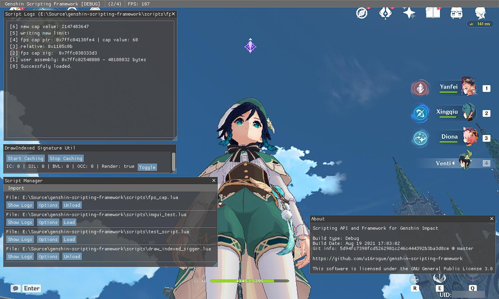

# Genshin Impact Scripting Framework

[](https://github.com/genshcript-dev/genshin-scripting-framework/releases)
[](https://github.com/genshcript-dev/genshin-scripting-framework/issues)
[](https://github.com/genshcript-dev/genshin-scripting-framework/blob/master/LICENSE)


[About](#About) • [Getting Started](#Getting-Started) • [Scripting API Documentation](script_api.md) • [Change Logs](change_logs.md) • [Libraries](#Libraries) • [License](#License)



## Repository
| Branch                                                                              | Status                                                                                                                                                                                                                                                                                 | Commit Count                                                                                                                  | Last Commit                                                                                           
|:-----------------------------------------------------------------------------------:|:--------------------------------------------------------------------------------------------------------------------------------------------------------------------------------------------------------------------------------------------------------------------------------------:|:-----------------------------------------------------------------------------------------------------------------------------:|:--------------------------------------------------------------------------------------------------------------------- |
| [master](https://github.com/genshcript-dev/genshin-scripting-framework/tree/master) | [](https://actions-badge.atrox.dev/genshcript-dev/genshin-scripting-framework/goto?ref=master) |  |   |

<!--- | [dev](https://github.com/genshcript-dev/genshin-scripting-framework/tree/dev)       | [](https://actions-badge.atrox.dev/genshcript-dev/genshin-scripting-framework/goto?ref=dev)       |     |      | --->

## About
Provides a scripting framework and API for the game [Genshin Impact](https://genshin.mihoyo.com/).

Scripting is done with the [chaiscript](https://chaiscript.com/index.html) scripting language which is loaded through the client module, after that the loaded script is allowed to execute code and access the provided API by GSF.

For more information regarding the chaiscript scripting language itself, a full doxygen documentation is provided [here](https://codedocs.xyz/ChaiScript/ChaiScript/LangGettingStarted.html).

If you are looking for the Scripting API provided by GSF, checkout the [Scripting API Documentation](script_api.md).

## Getting Started

### Prerequisite
* Windows
* [DirectX SDK](https://www.microsoft.com/en-au/download/details.aspx?id=6812)
* [Visual Studio 2019](https://visualstudio.microsoft.com/)

### Cloning
This requires [Git](https://git-scm.com/). If you don't have Git yet you can [download it here](https://git-scm.com/downloads).

* If you are planning on contributing or want access to the repo's history locally:
    
    ```sh
    git clone https://github.com/rogueeeee/genshin-scripting-framework.git
    ```

* If you only want to compile and use GSF you can download the repository as a [zip](https://github.com/rogueeeee/genshin-scripting-framework/archive/refs/heads/master.zip) directly or still use git by:

    ```sh
    git clone --depth 1 https://github.com/rogueeeee/genshin-scripting-framework.git
    ```

### Compiling
The project is ready to compile immediately, you can proceed by opening the solution file, setting up the configuration, and start building.

*If you get an error regarding a missing macro (**GSF_CLIENT_GIT_HASH**) and a header file (**git_hash.h**), simply build the project once and it should fix the problem. The macro and header file is automatically generated pre-build.*

## Libraries
* [MinHook](https://github.com/TsudaKageyu/minhook) - TsudaKageyu
* [Dear ImGui](https://github.com/ocornut/imgui) - ocornut
* [ChaiScript](https://github.com/ChaiScript/ChaiScript) - Jason Turner (*lefticus*)

## License
[GNU General Public License 3.0](https://www.gnu.org/licenses/gpl-3.0.en.html)